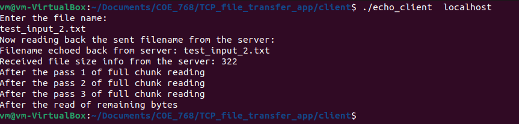

# Objective
A TCP based file file downloader has been implented based on client-server model. The server side can handle multiple concurrent connection requests from multiple clients requesting downloads of different files saved at the server side. 

# Build and run instructions
## Server
* Copy the echo_server.c and makefile into a seperate folder in a linux machine. 
* Build it by executing **make echo_server**
* Now add all the files you want the clients to download from this server in this folder.
* Finally run the server by entering **./echo_server \<port number\>**

## Client
* Copy the echo_client.c and the makefile into a seperate folder in a linux machine.
* Build it by executing **make echo_client**
* Run the client by entering **./echo_client \<server's IP address\> \<server's port number\>**
* Client will ask for the name of the file to be downloaded from the server. Enter a name which exists at the server side.
* The file will be now downloaded at the client side.

# Example 
A screenshot of a sample download session (from client side) is seen below: 
